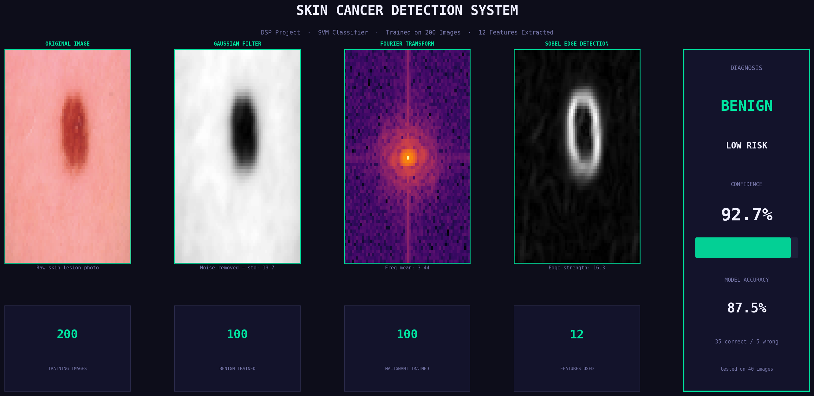

# Skin Cancer Detection System

A Digital Signal Processing (DSP) and Machine Learning project for classifying skin lesions as either **Benign** or **Malignant** using image processing techniques and a Support Vector Machine (SVM) classifier.



## Overview
This system uses classical computer vision and Digital Signal Processing (DSP) methods to extract meaningful features from skin lesion images, bypassing deep learning for an explainable and resource-efficient pipeline. 
The system extracts 12 distinct numerical features from each image and feeds them into an SVM for binary classification.

## Features Extracted
The pipeline relies on several image transformations to extract the following 12 key features:
1. **Gaussian Filter**: Applied to the grayscale image to remove noise and smooth the image.
2. **Fourier Transform**: Analyzes the image frequencies (mean, standard deviation, max value).
3. **Sobel Edge Detection**: Identifies strong vertical and horizontal boundaries in the image.
4. **HSV Color Analysis**: Computes statistical data (mean and standard deviation) for the Hue, Saturation, and Value channels.

## Technologies Used
- **Python 3**
- **OpenCV** (`cv2`): Image processing and color space conversion.
- **NumPy** (`numpy`): Fast numerical operations and array manipulations.
- **SciPy** (`scipy.fft`): Applying the Fourier Transform.
- **Scikit-Learn** (`sklearn`): Data scaling and the SVC (Support Vector Classifier).
- **Matplotlib** (`matplotlib`): Building the custom dynamic dashboard for results visualization.

## How to Run

### Prerequisites
Make sure you have Python installed and install the required dependencies:
```bash
pip install opencv-python numpy scipy scikit-learn matplotlib
```

### Dataset Structure
Ensure your data is placed in a `data` folder at the root directory following this structure:
```
data/
└── train/
    ├── benign/     # Put benign skin images here
    └── malignant/  # Put malignant skin images here
```

### Execution
Run the main script:
```bash
python main.py
```
1. The script will load up to 100 images from each class (by default) and extract their features.
2. It normalizes the data and splits it 80/20 for training and testing.
3. An SVM model is trained, and accuracy is evaluated on the test set.
4. Finally, a random image is selected from the dataset, and its processed panels and final prediction are displayed on a beautiful dashboard.

## Dashboard Panels
The Matplotlib-powered dashboard visualizes:
- The **Original Image**
- The **Gaussian Filter** applied to it.
- The **Fourier Transform** log scale frequencies.
- The **Sobel Edge Detection** strengths.
- The **Diagnosis** (Benign/Malignant), Prediction Confidence, and Model Accuracy.
